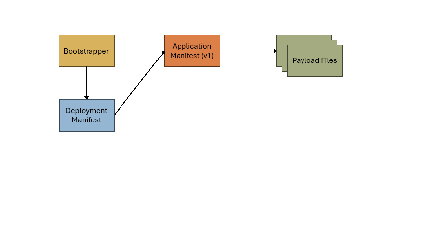

# ClickOnce Signing Algorithm

ClickOnce signing has been the source of numerous bugs, primarily because of fragile assumptions in Sign CLI's ClickOnce signing algorithm.

## Overview of a ClickOnce application

A ClickOnce application consists of:

* a deployment manifest:  a ClickOnce `.application` or `.vsto` file.
* an application manifest:  a ClickOnce `.manifest` file, not to be confused with a [side-by-side or fusion manifest file](https://learn.microsoft.com/windows/win32/sbscs/application-manifests) with the same extension.
* payload files:  assemblies and other files required by the application.
* a bootstrapper:  a `setup.exe` file for installing the ClickOnce application.

Publishing a ClickOnce application generates a bootstrapper, deployment and application manifest, and payload files.  The application manifest and payload files are published to a versioned directory, and the deployment manifest is updated to point to the new application manifest.  The bootstrapper points to the deployment manifest.



## Problem

Sign CLI's algorithm for signing ClickOnce applications is a source of bugs because of these fragile assumptions:

- The directory containing the deployment manifest file contains a single ClickOnce application version.  In reality, this directory can be the parent directory for many versions of the same ClickOnce application and/or the parent directory for many different ClickOnce applications.
- The directory containing the deployment manifest file contains at most one `.manifest` file in the directory tree.  This assumption overlaps with the previous assumption, but even if the directory only contains a single ClickOnce application version, the application may contain multiple `.manifest` files (i.e.:  an application manifest and one or more side-by-side manifests).

The impact of these failed assumptions is that the algorithm is subject to over-copying, over-signing, failing to sign ClickOnce applications containing a side-by-side manifest, and difficulty batch signing multiple ClickOnce applications.

There are two special cases that complicate signing:

1. VSTO publishing [signs the deployment manifest then copies it to the versioned application manifest file directory](https://devdiv.visualstudio.com/DevDiv/_git/VS?path=/src/ConfigData/BuildTargets/Microsoft.VisualStudio.Tools.Office.targets&version=GCba009548f0f1014f78b861e34bf4ef2700a28d25&line=473&lineEnd=483&lineStartColumn=9&lineEndColumn=11&lineStyle=plain&_a=contents), presumably for archival purposes.  The current algorithm will discover each deployment manifest file and, in separate operations, attempt to sign each manifest and its dependencies.
1. A [comment](https://github.com/dotnet/sign/blob/e268c46059ae415749de057a14c8919c6f063049/src/Sign.Core/DataFormatSigners/ClickOnceSigner.cs#L88-L90) in the existing implementation says:

    ```C#
    // It's possible that there might not actually be a .manifest file or any data files if the user just
    // wants to re-sign an existing deployment manifest because e.g. the update URL has changed but nothing
    // else has. In that case we don't need to touch the other files and we can just sign the deployment manifest.
    ```

## Proposed solution

Given a deployment manifest file as a starting point, the algorithm will be updated to:

1. resolve the local path for the application manifest using information in the deployment manifest
1. resolve the local path of payload files using information in the application manifest
1. resolve the local path of the bootstrapper in the same directory as the deployment manifest
1. copy and sign only these files in the order listed:
   - payload files
   - application manifest
   - deployment manifest
   - bootstrapper

Special cases will be made for VSTO deployment manifests.

- If step \#1 above succeeds, then the signed deployment manifest will be copied to the versioned application manifest file directory.
- If step \#1 above fails, it will be assumed that the deployment manifest file is in the versioned application manifest file directory and will be skipped for signing.

## Open questions

1. To handle the special case of re-signing only the deployment manifest file, it's unclear how we would reliably distinguish that case from the copied `.vsto` file in the versioned application manifest file directory.
   * How are CLI arguments identical between whole application and single file signing?
   * Is single file deployment manifest file signing done in place (with a reachable application manifest file) or in isolation from other files?

## Appendix A:  Current algorithm

In a temporary directory:

1. [[source](https://github.com/dotnet/sign/blob/e268c46059ae415749de057a14c8919c6f063049/src/Sign.Core/Signer.cs#L135-L147)]  Copy the deployment manifest to a random file name with the same file extension (`.application` or `.vsto`).
1. [[source](https://github.com/dotnet/sign/blob/e268c46059ae415749de057a14c8919c6f063049/src/Sign.Core/DataFormatSigners/ClickOnceSigner.cs#L261-L274)]  Copy all files from the deployment manifest's source directory and all its subdirectories to the temporary directory, while preserving the source's directory structure. _Because copying does not filter down to manifests and payload files, this step can result in overcopying._
1. [[source](https://github.com/dotnet/sign/blob/e268c46059ae415749de057a14c8919c6f063049/src/Sign.Core/DataFormatSigners/ClickOnceSigner.cs#L97-L113)]  Sign all `.deploy` and `.exe` files included by user's file matching patterns. _Previous overcopying can lead to oversigning in this step._
1. [[source](https://github.com/dotnet/sign/blob/e268c46059ae415749de057a14c8919c6f063049/src/Sign.Core/DataFormatSigners/ClickOnceSigner.cs#L115-L123)]  Remove the `.deploy` extension on any remaining files _excluded_ by file matching patterns.  While these files may not be signed, they're still necessary to update the application manifest.
1. [[source](https://github.com/dotnet/sign/blob/e268c46059ae415749de057a14c8919c6f063049/src/Sign.Core/DataFormatSigners/ClickOnceSigner.cs#L130-L139)]  Find files with the `.manifest` file extension.
   * If there are none, continue without signing application manifest.
   * If there is exactly one, assume it is the application manifest and sign it.
   * If there are multiple files, fail.  _This can happen because of earlier overcopying or because side-by-side manifests are not ignored._
1. [[source](https://github.com/dotnet/sign/blob/e268c46059ae415749de057a14c8919c6f063049/src/Sign.Core/DataFormatSigners/ClickOnceSigner.cs#L155-L183)]  Sign all deployment manifests in file path length order descending.  _Previous overcopying can lead to oversigning in this step._
1. [[source](https://github.com/dotnet/sign/blob/e268c46059ae415749de057a14c8919c6f063049/src/Sign.Core/DataFormatSigners/ClickOnceSigner.cs#L155-L183)]  Restore `.deploy` extensions.
1. [[source](https://github.com/dotnet/sign/blob/e268c46059ae415749de057a14c8919c6f063049/src/Sign.Core/DataFormatSigners/ClickOnceSigner.cs#L186-L189)]  Copy files from the temporary directory back to the source location.  _Previous overcopying can lead to overcopying in this step._

Here are two examples of how the current algorithm overcopies and oversigns.

* With the layout as described in [this comment](https://github.com/dotnet/sign/issues/681#issuecomment-2426793329), the current algorithm would sign every version of the application, instead of just the version referenced by App.application:

  ```
  App.application
      Application Files
          App_1_0_0_0
              App.dll.deploy
              App.dll.manifest
              App.exe.deploy
              ...
          App_1_0_1_0
              App.dll.deploy
              App.dll.manifest
              App.exe.deploy
              ...
          ...
  ...
  ```

* With the layout as described in [this comment](https://github.com/dotnet/sign/issues/681#issuecomment-2425548289), each deployment manifest and payload file would be signed _n_ times, where _n_ is the number of `.vsto` files.

  ```
  Output
      myAddin.Word.dll
      myAddin.PowerPoint.dll
      myAddin.Excel.dll

      myAddin.Word.vsto
      myAddin.PowerPoint.vsto
      myAddin.Excel.vsto

      myAddin.Word.dll.manifest
      myAddin.PowerPoint.dll.manifest
      myAddin.Excel.dll.manifest
  ```

## Appendix B:  Proposed algorithm

1. If a file has a `.vsto` or `.application` file extension, read it as a deployment manifest using [`ManifestReader.ReadManifest(...)`](https://learn.microsoft.com/dotnet/api/microsoft.build.tasks.deployment.manifestutilities.manifestreader.readmanifest?view=msbuild-17-netcore#microsoft-build-tasks-deployment-manifestutilities-manifestreader-readmanifest(system-io-stream-system-boolean)).  If file reading fails or the returned [`Manifest`](https://learn.microsoft.com/dotnet/api/microsoft.build.tasks.deployment.manifestutilities.manifest?view=msbuild-17-netcore) instance is not a [`DeployManifest`](https://learn.microsoft.com/dotnet/api/microsoft.build.tasks.deployment.manifestutilities.deploymanifest?view=msbuild-17-netcore), defer to next signer.
1. Set [`Manifest.ReadOnly`](https://learn.microsoft.com/dotnet/api/microsoft.build.tasks.deployment.manifestutilities.manifest.readonly?view=msbuild-17-netcore) to `true` to ensure read-only mode.
1. Use [`Manifest.ResolveFiles()`](https://learn.microsoft.com/dotnet/api/microsoft.build.tasks.deployment.manifestutilities.manifest.resolvefiles?view=msbuild-17-netcore#microsoft-build-tasks-deployment-manifestutilities-manifest-resolvefiles) to resolve paths.  This method:
   > Locates all specified assembly and file references by searching in the same directory as the loaded manifest, or in the current directory. The location of each referenced assembly and file is required for hash computation and assembly identity resolution. Any resulting errors or warnings are reported in the OutputMessages collection.
1. Log all messages in [`Manifest.OutputMessages`](https://learn.microsoft.com/dotnet/api/microsoft.build.tasks.deployment.manifestutilities.manifest.outputmessages?view=msbuild-17-netcore).
1. If `Manifest.OutputMessages` contains any errors, fail signing.
1. Obtain the full path of the application manifest file from [`DeployManifest.EntryPoint`](https://learn.microsoft.com/dotnet/api/microsoft.build.tasks.deployment.manifestutilities.deploymanifest.entrypoint?view=msbuild-17-netcore)[`.ResolvedPath`](https://learn.microsoft.com/dotnet/api/microsoft.build.tasks.deployment.manifestutilities.basereference.resolvedpath?view=msbuild-17-netcore#microsoft-build-tasks-deployment-manifestutilities-basereference-resolvedpath).
1. If the application manifest file does not exist, log a warning and stop further processing of the deployment manifest file.
1. Read the application manifest file using `ManifestReader.ReadManifest(...)`.
1. Set `Manifest.ReadOnly` to `true` to ensure read-only mode.
1. Interate through both [`AssemblyReferences`](https://learn.microsoft.com/dotnet/api/microsoft.build.tasks.deployment.manifestutilities.manifest.assemblyreferences?view=msbuild-17-netcore) and [`FileReferences`](https://learn.microsoft.com/dotnet/api/microsoft.build.tasks.deployment.manifestutilities.manifest.filereferences?view=msbuild-17-netcore), manually resolve `TargetPath` property to the base path of the application manifest file.
   * Note:  it seems like calling `Manifest.ResolveFiles()` would resolve the full file path for every file dependency in the application manifest.  However, this fails because `ResolveFiles()` assumes dependency files do not have `.deploy` file extension, but they do.  We could temporarily remove the `.deploy` extension and then call `ResolveFiles()` but a user's glob patterns might filter out files based on the `.deploy` extension.  The safest option is to resolve file paths ourselves.
1. Copy all files from the previous step, including the application manifest file itself, to a temporary directory.
1. Sign files in the following order:  files alongside the application manifest, the application manifest itself, then the deployment manifest.
1. Copy the files back.
1. If the signed deployment manifest file is a `.vsto` file, copy it to the versioned application manifest file directory and overwrite if necessary.

