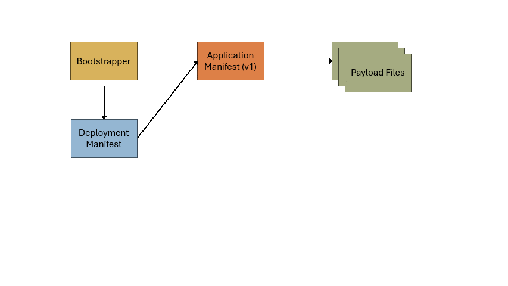

# ClickOnce Signing Algorithm

ClickOnce signing has been the source of numerous bugs, primarily because of fragile assumptions in Sign CLI's ClickOnce signing algorithm. This spec proposes algorithm changes that will fix those bugs while improving ClickOnce signing accuracy and predictability.

In this spec, ClickOnce signing includes both standard ClickOnce `.application` deployment manifests and VSTO `.vsto` deployment manifests. VSTO-specific behavior is identified where relevant.

## Overview of a ClickOnce application

A ClickOnce application consists of:

* a deployment manifest:  a ClickOnce `.application` or `.vsto` file.
* an application manifest:  a ClickOnce `.manifest` file, not to be confused with a [side-by-side or fusion manifest file](https://learn.microsoft.com/windows/win32/sbscs/application-manifests) with the same extension.
* payload files:  assemblies and other files required by the application.

Published output may also include:

* optionally, a `setup.exe` bootstrapper for installing prerequisite packages before the ClickOnce application.
* optionally, a `Launcher.exe` file for launching the .NET application. `Launcher.exe` does not participate in ClickOnce activation.

Publishing a ClickOnce application generates deployment and application manifests and payload files, and may also generate a bootstrapper or launcher. In a typical Visual Studio publish layout, the deployment manifest is in the parent publish directory, while the application manifest and payload files are in a version-specific child directory. The deployment manifest points to the application manifest for the current version. Other valid layouts may organize these files differently.



## Problem

Sign CLI assumes:

- The directory containing the deployment manifest file contains a single ClickOnce application version. In reality, this directory can be the parent directory for multiple versions of the same ClickOnce application and/or the parent directory for multiple ClickOnce applications.
- The directory containing the deployment manifest file contains at most one `.manifest` file in the directory tree. This assumption overlaps with the previous assumption, but even if the directory only contains a single ClickOnce application version, the application may contain multiple `.manifest` files (e.g., an application manifest and one or more side-by-side manifests).
- All `.manifest` files are ClickOnce application manifests, when in reality side-by-side (fusion) manifests also use the `.manifest` extension.
- All non-`.deploy` `.exe` files found anywhere in the deployment manifest's directory tree are treated as dependencies of that manifest. The defect is not that these executable files are Authenticode signed, but that the ClickOnce signer discovers them indiscriminately across all application versions instead of following the deployment manifest's references and checking only applicable adjacent files.
- Manifests are well-formed and files referenced within them exist at the expected locations. When these assumptions fail, the algorithm's behavior is undefined or produces unclear error messages.
- Files are unique within the staging directory and won't be copied or processed multiple times due to directory tree traversal or references from multiple manifests. The staging directory is the temporary working directory where Sign CLI copies files before signing and from which it copies successful results back to their original locations.
- A single invocation should process an entire ClickOnce application, making it difficult to support partial re-signing scenarios where users want to re-sign only specific components.

The impact is that the algorithm is subject to over-copying, over-signing, failing to sign ClickOnce applications containing a side-by-side manifest, and difficulty with batch signing multiple ClickOnce applications.

There are two special cases that complicate signing:

1. VSTO publishing [signs the deployment manifest then copies it to the versioned application manifest file directory](https://devdiv.visualstudio.com/DevDiv/_git/VS?path=/src/ConfigData/BuildTargets/Microsoft.VisualStudio.Tools.Office.targets&version=GCa9fb919e0a7b3a62050cc77d5dc7dd7c38d50b0e&line=473&lineEnd=483&lineStartColumn=9&lineEndColumn=11&lineStyle=plain&_a=contents) for archival purposes. The current algorithm will discover each deployment manifest file and, in separate operations, attempt to sign each manifest and its dependencies.
1. Sometimes [manifests need to be re-signed](https://learn.microsoft.com/visualstudio/deployment/how-to-re-sign-application-and-deployment-manifests?view=vs-2022). For re-signing, users need to be able to disable implicit signing of related files. For example, a user should be able to re-sign only a deployment manifest or just deployment and application manifests without re-signing payload files.

## Proposed solution

Given a deployment manifest file as a starting point, the algorithm will be updated to:

1. Load the deployment manifest, locate the referenced application manifest, and, by default, refuse to continue if it is missing.
1. Stage only the files referenced by the manifests and any applicable adjacent `setup.exe` or `Launcher.exe`.
1. Sign the payloads, refresh the application manifest's metadata, and sign the application manifest. Then refresh the deployment manifest's entry-point metadata, sign the deployment manifest, and finally sign the adjacent executables so hashes, sizes, identities, and entry-point information are consistent with the newly signed files.

Implementation specifics, including path resolution, `.deploy` renaming, and `ManifestUtilities` API calls, are detailed in Appendix B.

The proposed solution requires no changes to the .NET Framework `mage.exe` distributed with Sign CLI. The algorithm changes are implemented in Sign CLI by coordinating existing manifest APIs and signing behavior, and manifest signing continues through Sign CLI's existing programmatic manifest signer. Any new assembly or package reference needed to call `ManifestUtilities` is a Sign CLI implementation dependency, not a modification to `mage.exe`.

The proposed solution will not attempt to mirror VSTO publishing and copy a signed deployment manifest into the application manifest directory. VSTO publishing creates this second copy for archival purposes, and [Microsoft's manifest re-signing guidance](https://learn.microsoft.com/visualstudio/deployment/how-to-re-sign-application-and-deployment-manifests?view=visualstudio) treats the copy as optional. No source reviewed for this spec establishes that ClickOnce or the VSTO runtime consumes the copy during installation, launch, update, or rollback. However, legacy or downstream tooling may expect the two files to remain identical. Users who require parity with the VSTO publish layout must explicitly copy the signed deployment manifest. Whether ClickOnce or VSTO publishing should stop producing the archival copy is outside the scope of Sign CLI.

### Non-goals

This proposal does not make a signing invocation transactional. Sign CLI may copy successfully signed files back before a later file fails, leaving a mix of signed and unsigned files. Invocation-wide atomicity is independent of the ClickOnce algorithm changes and should be addressed separately.

### Signing operation coordination

To prevent signing the same file multiple times when users specify overlapping inputs (e.g., both a deployment manifest and its dependencies via glob patterns), Sign CLI will coordinate signing operations by canonical file path. The first caller to encounter a path owns its signing operation. Other callers that encounter the same path wait for that operation to complete and observe the same success or failure before continuing. A successful operation is complete only when its signed result is available for reuse by waiting callers, including callers that need the file in another staging layout.

This coordination is scoped to a single CLI invocation and is not persisted to disk. Running the same command twice will re-sign all files on the second invocation.

Coordinating the complete operation, rather than using a non-atomic check followed by marking the file as signed, prevents parallel inputs from signing the same file concurrently. Waiting for the owning operation also ensures that a manifest is not updated before a shared dependency has finished signing. The precise synchronization mechanism is an implementation detail. This mechanism is independent of other algorithm changes and applies to all file types, not just ClickOnce files.

Implicit ClickOnce dependency traversal and user file matching remain separate. Starting from a deployment manifest, the ClickOnce signer follows only the referenced application version. Independently, Sign CLI continues to sign every signable file matched by the user's base directory and file patterns, including files in other version directories unless the user excludes them. Coordination prevents files reached through both paths from being signed twice.

For re-signing scenarios, two new options will be introduced (both require ClickOnce signing algorithm version 2):

* `--no-sign-clickonce-deps`: When specified, Sign CLI will update and sign only the explicitly specified manifest files without signing their dependencies (referenced manifests or payload files). Manifests are still updated before signing to refresh metadata. This allows users to re-sign only a deployment manifest, or only an application manifest, while ensuring the manifest's metadata remains consistent with its dependencies.
* `--no-update-clickonce-manifest`: When specified, Sign CLI will sign manifest files without resolving files or updating file information. This is useful when re-signing a manifest whose dependencies have not changed.

These options are mutually exclusive (see [Option interactions](#option-interactions)). Without these options, Sign CLI will discover, update, and sign the complete ClickOnce application (deployment manifest, application manifest, all referenced payload files, and applicable adjacent executables).

**Note**: Both `--no-sign-clickonce-deps` and `--no-update-clickonce-manifest` are only valid when the effective ClickOnce signing algorithm version is 2. Attempting to use these options with version 1 will result in an error.

### Rollout strategy

The `--clickonce-signing-version <version>` option selects the ClickOnce signing algorithm. The supported values are:

* `1`: The current algorithm described in Appendix A.
* `2`: The manifest-driven algorithm described in Appendix B.

Initially, omitting `--clickonce-signing-version` selects version 1, so version 2 is opt-in. This avoids breaking existing workflows, particularly the deployment-manifest-only re-signing scenario, where version 1 succeeds when no application manifest is present while version 2's default behavior requires one. It also gives users who depend on recursive dependency discovery or VSTO archival-copy behavior time to adapt their pipelines.

The option affects only ClickOnce signing; other signing formats are unchanged. Values other than `1` or `2` result in a command-line validation error.

The three new CLI options introduced by this spec are:

| Option | Requires version 2 | Purpose |
|---|---|---|
| `--clickonce-signing-version <version>` | No | Selects ClickOnce signing algorithm version 1 or 2. Initially defaults to 1. |
| `--no-sign-clickonce-deps` | Yes | Updates and signs only the specified manifests; does not sign referenced payload files or dependent manifests. |
| `--no-update-clickonce-manifest` | Yes | Signs manifests without resolving files or updating file information. |

No short alias is defined for `--clickonce-signing-version`.

When the effective version is 1:

* The current algorithm (Appendix A) is used.
* Passing `--no-sign-clickonce-deps` or `--no-update-clickonce-manifest` results in an error.

No warning will be emitted for version 1 during the initial version 2 opt-in period. After version 2 has proven stable, Sign CLI will begin warning when the effective version is 1 and recommend version 2. In a future major release, version 2 may become the default. Explicitly selecting version 1 will remain available as an escape hatch and will continue to emit the warning. Default changes and warnings will be communicated through release notes in advance.

### CLI examples

The examples below elide certificate and timestamp options (`-cfp`, `-cf`, `-p`, `-t`) for clarity.

#### Sign a ClickOnce application (full pipeline)

```shell
sign code certificate-store ... --clickonce-signing-version 2 -b publish\ App.application
```

Signs the complete application: payload files, application manifest, deployment manifest, and applicable adjacent executables, in the correct order. The algorithm follows the deployment manifest's references. Only the version it points to is implicitly discovered; other signable files matched by the user are still signed normally.

#### Sign a multi-version layout without over-signing

Given a layout with multiple published versions:

```
publish\
├── App.application                    ← points to v1.0.1.0
└── Application Files\
    ├── App_1_0_0_0\...                ← old version
    └── App_1_0_1_0\...                ← current version
```

```shell
# Version 1 — fails (SingleOrDefault with >1 .manifest file)
sign code certificate-store ... -b publish\ App.application

# Version 2 — implicitly discovers only v1.0.1.0 (the referenced version)
sign code certificate-store ... --clickonce-signing-version 2 -b publish\ App.application
```

#### Sign multiple VSTO add-ins in one invocation

```shell
sign code certificate-store ... --clickonce-signing-version 2 -b Output\ **/*.vsto
```

Each `.vsto` file is processed independently: its referenced application manifest and payload files are discovered and signed. Signing operations for shared files are coordinated so each file is signed only once and all dependents wait for signing to complete.

#### Re-sign only a deployment manifest (after payload changes)

```shell
sign code certificate-store ... --clickonce-signing-version 2 --no-sign-clickonce-deps -b publish\ App.application
```

Updates the deployment manifest's metadata (sizes, hashes) to reflect the current state of its dependencies, then signs only the deployment manifest. Dependencies are not signed.

#### Re-sign a manifest without updating metadata

```shell
sign code certificate-store ... --clickonce-signing-version 2 --no-update-clickonce-manifest -b publish\ App.application
```

Signs the deployment manifest as-is, without resolving files or updating file information. Useful when re-signing with a different certificate and dependencies have not changed.

## Appendix A:  Signing algorithm version 1

In a temporary directory:

1. [[source](https://github.com/dotnet/sign/blob/d4a580a9232e9d7aac931ea57b844e87e255af9a/src/Sign.Core/Signer.cs#L137-L149)]  Copy the deployment manifest to a random file name with the same file extension (`.application` or `.vsto`).
1. [[source](https://github.com/dotnet/sign/blob/d4a580a9232e9d7aac931ea57b844e87e255af9a/src/Sign.Core/DataFormatSigners/ClickOnceSigner.cs#L261-L274)]  Copy all files from the deployment manifest's source directory and all its subdirectories to the temporary directory, while preserving the source's directory structure. _Because copying does not filter down to manifests and payload files, this step can result in overcopying._
1. [[source](https://github.com/dotnet/sign/blob/d4a580a9232e9d7aac931ea57b844e87e255af9a/src/Sign.Core/DataFormatSigners/ClickOnceSigner.cs#L97-L113)]  Sign all `.deploy` and `.exe` files included by user's file matching patterns. _Previous overcopying can lead to oversigning in this step._
1. [[source](https://github.com/dotnet/sign/blob/d4a580a9232e9d7aac931ea57b844e87e255af9a/src/Sign.Core/DataFormatSigners/ClickOnceSigner.cs#L115-L123)]  Remove the `.deploy` extension on any remaining files _excluded_ by file matching patterns.  While these files may not be signed, they're still necessary to update the application manifest.
1. [[source](https://github.com/dotnet/sign/blob/d4a580a9232e9d7aac931ea57b844e87e255af9a/src/Sign.Core/DataFormatSigners/ClickOnceSigner.cs#L130-L139)]  Find files with the `.manifest` file extension.
   * If there are none, continue without signing application manifest.
   * If there is exactly one, assume it is the application manifest and sign it.
   * If there are multiple files, fail.  _This can happen because of earlier overcopying or because side-by-side manifests are not ignored._
1. [[source](https://github.com/dotnet/sign/blob/d4a580a9232e9d7aac931ea57b844e87e255af9a/src/Sign.Core/DataFormatSigners/ClickOnceSigner.cs#L155-L183)]  Sign all deployment manifests in file path length order descending.  _Previous overcopying can lead to oversigning in this step._
1. [[source](https://github.com/dotnet/sign/blob/d4a580a9232e9d7aac931ea57b844e87e255af9a/src/Sign.Core/DataFormatSigners/ClickOnceSigner.cs#L185-L189)]  Restore `.deploy` extensions.
1. [[source](https://github.com/dotnet/sign/blob/d4a580a9232e9d7aac931ea57b844e87e255af9a/src/Sign.Core/Signer.cs#L160-L161)]  Copy files from the temporary directory back to the source location.  _Previous overcopying can lead to overcopying in this step._

Here are two examples of how the current algorithm overcopies and oversigns.

* With the layout as described in [this comment](https://github.com/dotnet/sign/issues/681#issuecomment-2426793329), the current algorithm would sign every version of the application, instead of just the version referenced by App.application:

  ```
  App.application
      Application Files
          App_1_0_0_0
              App.dll.deploy
              App.dll.manifest
              App.exe.deploy
              ...
          App_1_0_1_0
              App.dll.deploy
              App.dll.manifest
              App.exe.deploy
              ...
          ...
  ...
  ```

* With the layout as described in [this comment](https://github.com/dotnet/sign/issues/681#issuecomment-2425548289), each deployment manifest and payload file would be signed _n_ times, where _n_ is the number of `.vsto` files.

  ```
  Output
      myAddin.Word.dll
      myAddin.PowerPoint.dll
      myAddin.Excel.dll

      myAddin.Word.vsto
      myAddin.PowerPoint.vsto
      myAddin.Excel.vsto

      myAddin.Word.dll.manifest
      myAddin.PowerPoint.dll.manifest
      myAddin.Excel.dll.manifest
  ```

## Appendix B:  Signing algorithm version 2

`Manifest` provides a parameterless `UpdateFileInfo()` overload and an `UpdateFileInfo(string targetFrameworkVersion)` overload. Version 2 does not call the parameterless overload, which computes SHA-1 hashes for referenced files. Whenever version 2 updates file information, it calls `UpdateFileInfo("v4.5")`. MSBuild's manifest utility implementation selects SHA-256 when the supplied target framework version is greater than `"v4.0"`; `"v4.5"` selects the hashing behavior and does not represent the application's target framework. This preserves Sign CLI's current SHA-256 behavior and does not add support for ClickOnce runtimes that require SHA-1 manifest hashes.

When `DeployManifest.MapFileExtensions` is `true`, ClickOnce file-extension mapping leaves manifest target paths unchanged and appends one additional `.deploy` suffix to physical published payload files. Whenever version 2 stages a mapped payload, it preserves the physical filename, records that the additional suffix was mapped, and copies the source without renaming it. Before resolving staged references or calling `UpdateFileInfo(...)`, temporarily remove only the recorded suffix from the staged copy, then restore it afterward. Do not remove a `.deploy` suffix that is part of the manifest target path.

### Default behavior (no dependency options)

1. Before staging or signing any file, obtain the coordinated signing operation for its canonical source path (via `Path.GetFullPath()`). The first caller owns the operation; duplicate callers wait for its result before staging or consuming the file.
1. Determine the file type and read the manifest:
   - For a `.vsto` or `.application` file, follow [Deployment-manifest input](#deployment-manifest-input).
   - For a `.manifest` file, follow [Standalone application-manifest input](#standalone-application-manifest-input).
   - For any other file type, apply the standard signing logic.

#### Deployment-manifest input

1. Read the file using [`ManifestReader.ReadManifest(...)`](https://learn.microsoft.com/dotnet/api/microsoft.build.tasks.deployment.manifestutilities.manifestreader.readmanifest?view=msbuild-17-netcore#microsoft-build-tasks-deployment-manifestutilities-manifestreader-readmanifest(system-io-stream-system-boolean)). If reading fails or the returned [`Manifest`](https://learn.microsoft.com/dotnet/api/microsoft.build.tasks.deployment.manifestutilities.manifest?view=msbuild-17-netcore) is not a [`DeployManifest`](https://learn.microsoft.com/dotnet/api/microsoft.build.tasks.deployment.manifestutilities.deploymanifest?view=msbuild-17-netcore), fail the operation without signing the file.
1. Ensure [`Manifest.ReadOnly`](https://learn.microsoft.com/dotnet/api/microsoft.build.tasks.deployment.manifestutilities.manifest.readonly?view=msbuild-17-netcore) is `false` so the deployment manifest can be updated.
1. Call [`DeployManifest.ResolveFiles(string[])`](https://learn.microsoft.com/dotnet/api/microsoft.build.tasks.deployment.manifestutilities.manifest.resolvefiles?view=msbuild-17-netcore) with the deployment manifest's directory to resolve its references, including the application-manifest entry point.
1. Log all messages in [`Manifest.OutputMessages`](https://learn.microsoft.com/dotnet/api/microsoft.build.tasks.deployment.manifestutilities.manifest.outputmessages?view=msbuild-17-netcore). Continue when diagnostics do not prevent resolving required files; otherwise fail with a clear error.
1. Obtain the full path of the application manifest file from [`DeployManifest.EntryPoint`](https://learn.microsoft.com/dotnet/api/microsoft.build.tasks.deployment.manifestutilities.deploymanifest.entrypoint?view=msbuild-17-netcore)[`.ResolvedPath`](https://learn.microsoft.com/dotnet/api/microsoft.build.tasks.deployment.manifestutilities.basereference.resolvedpath?view=msbuild-17-netcore#microsoft-build-tasks-deployment-manifestutilities-basereference.resolvedpath). If the path is empty or the file does not exist, fail signing with an error message that identifies the expected path and suggests `--clickonce-signing-version 2 --no-update-clickonce-manifest` when the user only needs to re-sign the deployment manifest.
1. Read the application manifest file using `ManifestReader.ReadManifest(...)`. If reading fails or the returned manifest is not an [`ApplicationManifest`](https://learn.microsoft.com/dotnet/api/microsoft.build.tasks.deployment.manifestutilities.applicationmanifest?view=msbuild-17-netcore), fail with a clear error. Ensure `Manifest.ReadOnly` is `false`.
1. Identify each application-manifest `AssemblyReference` and `FileReference` that represents a physical file published with the application, following the file-extension mapping rules above and searching the application manifest's directory first, then the deployment manifest's directory as a fallback (if different). Log all `OutputMessages` produced by resolution attempts. Continue when diagnostics do not prevent locating required files; otherwise fail with a clear error.
1. Copy the deployment manifest, application manifest, and located payload files to a temporary directory. Stage each payload at its manifest target path relative to the staged application manifest while preserving any mapping-added suffix.
1. Temporarily remove mapping-added suffixes from the staged payloads.
1. Before signing or updating manifest metadata, ensure that the application manifest's references resolve to the corresponding staged files. No `ResolvedPath` used by `UpdateFileInfo(...)` may identify a source file outside the staging directory. How the implementation establishes the staged paths is an implementation detail. Fail if any required staged file cannot be resolved.
1. Discover applicable adjacent executables by checking if `setup.exe` or `Launcher.exe` exists in the same directory as the deployment manifest. `setup.exe` is an optional prerequisite bootstrapper; `Launcher.exe` launches the .NET application but does not participate in ClickOnce activation. A launcher or bootstrapper in a different directory or with a different name is not implicitly discovered as a dependency, but it will still be signed through standard Authenticode signing if matched by the user's file patterns.
1. Sign payload files.
1. Call `ApplicationManifest.UpdateFileInfo("v4.5")` to refresh payload SHA-256 hashes, sizes, and identities, then restore the mapping-added suffixes. (`UpdateFileInfo(string)` hashes each reference's current `ResolvedPath`; ensure those paths identify the staged, suffix-stripped payloads before calling it.) Make the signed payload results available to waiting callers and complete their coordinated signing operations. Then sign the application manifest, make its signed result available, and complete its operation.
1. Signing the application manifest changes its signed bytes and can change its assembly identity, including its public key token. Ensure that the deployment manifest's entry-point `ResolvedPath` identifies the signed staged application manifest, then call `DeployManifest.UpdateFileInfo("v4.5")` to refresh the entry-point reference's SHA-256 hash and size. Ensure that the entry-point identity matches the signed application manifest before signing the deployment manifest. When signing the deployment manifest with `mage.exe -update`, the `-appm` parameter performs this entry-point update. Make the signed deployment manifest available and complete its operation.
1. Sign applicable adjacent executables, make their signed results available, and complete their operations.
1. Copy any remaining signed files back to their original locations and clean up the staging directory.

#### Standalone application-manifest input

1. Read the file using `ManifestReader.ReadManifest(...)`. If reading fails or the returned manifest is not an `ApplicationManifest`, fail the operation without signing the file.
1. Ensure `Manifest.ReadOnly` is `false`.
1. Identify each `AssemblyReference` and `FileReference` that represents a physical file published with the application. Look for its manifest target path relative to the application manifest's directory first; if that path does not exist, look for the same path with one additional `.deploy` suffix and record that suffix as mapping-added. Log all `OutputMessages` produced by resolution attempts. Continue when diagnostics do not prevent locating required files; otherwise fail with a clear error.
1. Copy the application manifest and located payload files to a temporary directory. Stage each payload at its manifest target path relative to the staged application manifest while preserving any mapping-added suffix.
1. Temporarily remove mapping-added suffixes from the staged payloads.
1. Before signing or updating manifest metadata, ensure that the application manifest's references resolve to the corresponding staged files. No `ResolvedPath` used by `UpdateFileInfo(...)` may identify a source file outside the staging directory. How the implementation establishes the staged paths is an implementation detail. Fail if any required staged file cannot be resolved.
1. Sign payload files.
1. Call `ApplicationManifest.UpdateFileInfo("v4.5")`, restore the mapping-added suffixes, make the signed payload results available, and complete their coordinated signing operations.
1. Sign the application manifest, make its signed result available, and complete its operation.
1. Copy any remaining signed files back to their original locations and clean up the staging directory.

### With `--no-sign-clickonce-deps`

When `--no-sign-clickonce-deps` is specified, Sign CLI will update and sign only the explicitly provided manifest files without signing their dependencies:

1. Before processing any file, obtain or wait for its coordinated signing operation.
1. If both a deployment manifest and its referenced application manifest are explicitly provided in the same invocation, update and sign the application manifest first, regardless of input order or parallel scheduling. The deployment-manifest operation must wait for the application-manifest operation to complete successfully before refreshing its entry-point metadata and signing. If the application-manifest operation fails, do not sign the deployment manifest.
1. For each file provided by the user:
   - If the file has a `.vsto` or `.application` file extension, read it as a deployment manifest and call `DeployManifest.ResolveFiles(string[])` with the deployment manifest's directory. Call `DeployManifest.UpdateFileInfo("v4.5")` to refresh the entry-point reference's SHA-256 hash and size, ensure that the entry-point identity matches the referenced application manifest's current identity, then sign only the deployment manifest.
   - If the file has a `.manifest` file extension, follow the standalone application-manifest discovery, staging, resolution, and update steps above, but skip payload signing and do not copy staged payloads back. Sign and copy back only the application manifest.
   - For other file types, apply the standard signing logic.
1. Complete each coordinated signing operation after its file is signed.
1. Referenced manifests and payload files are discovered during the update process but are not signed.
1. The user is responsible for ensuring files are re-signed in the correct order (payload files first, then application manifest, then deployment manifest) if re-signing multiple manifests across separate invocations.

### With `--no-update-clickonce-manifest`

When `--no-update-clickonce-manifest` is specified, Sign CLI will sign manifest files without updating them:

1. Before processing any file, obtain or wait for its coordinated signing operation.
1. For each file provided by the user:
   - If the file has a `.vsto` or `.application` file extension, read it as a deployment manifest and sign it without resolving files or updating file information.
   - If the file has a `.manifest` file extension, read it as an application manifest and sign it without resolving files or updating file information.
   - For other file types, apply the standard signing logic.
1. Complete each coordinated signing operation after its file is signed.
1. No ClickOnce dependency discovery or manifest metadata updates occur.
1. This option is useful when re-signing manifests whose dependencies have not changed.

### Option interactions

The `--no-sign-clickonce-deps` and `--no-update-clickonce-manifest` options are mutually exclusive:

* `--no-sign-clickonce-deps` alone: Update and sign only specified manifests (dependencies discovered but not signed).
* `--no-update-clickonce-manifest` alone: Sign only specified manifests without updating them (no discovery of dependencies). This is the fastest option, but the user must ensure manifests are already consistent with their dependencies.
* Both options together: Not allowed. `--no-update-clickonce-manifest` skips all discovery and metadata updates, which fully subsumes the dependency-skipping behavior of `--no-sign-clickonce-deps`. Sign CLI will emit an error: `The '--no-sign-clickonce-deps' and '--no-update-clickonce-manifest' options cannot be combined.`
